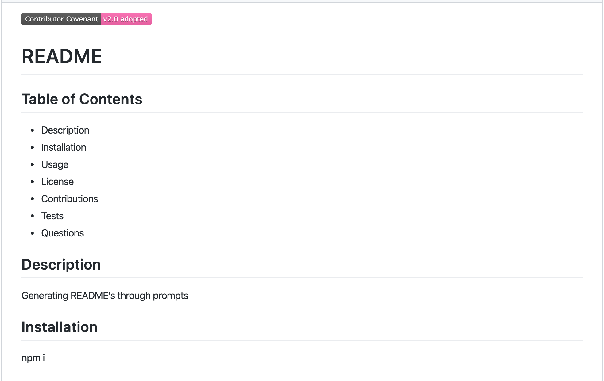
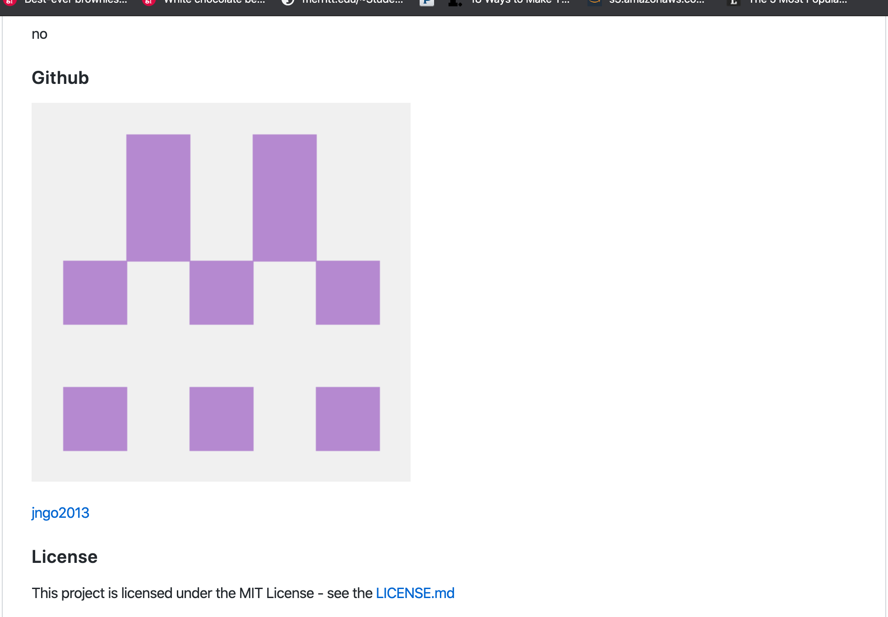

# Generating README

## Description

- A coding that helps assist generating README's for projects.
- Code will give you prompts to answer and then generates a README based on your answers/choices

## Technologies

- Inquirer,fs,axios

## Challenges

- Not too difficult except for retrieving github image.
- I learned to make a generator to make a README and also more about Mark Downs.
- I solved the problem by either googling or asking peers for assistance in understanding the areas where I struggled.
  
## Screen shot

 
 

